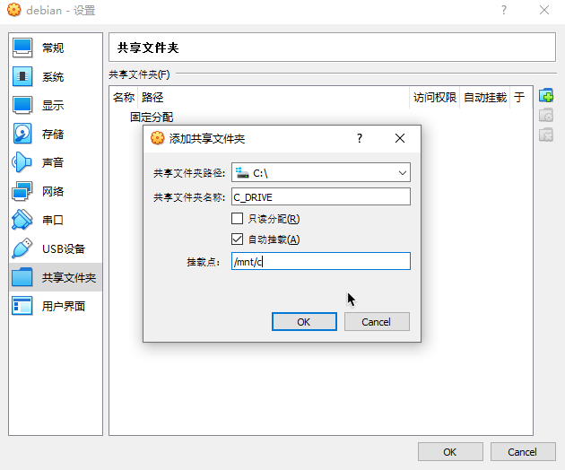
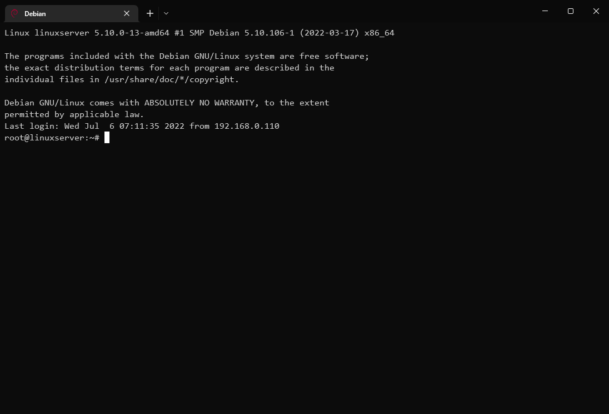
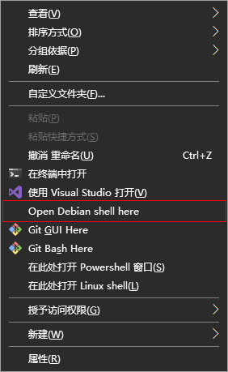
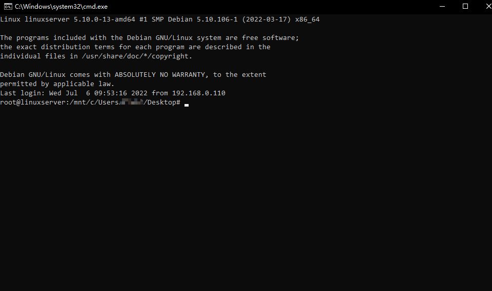

# Windows-LinuxVM 集成

一系列关于Windows主机与Linux虚拟机的集成技巧。

适合读者：Linux虚拟机用户，Linux VPS用户，WSL用户

内容：

<!--ts-->
   * [背景](#背景)
   * [介绍](#介绍)
   * [操作](#操作)
      * [特别说明](#特别说明)
      * [前提准备](#前提准备)
         * [安装VirtualBox](#安装virtualbox)
         * [创建虚拟机](#创建虚拟机)
         * [安装Linux操作系统](#安装linux操作系统)
      * [Linux端操作](#linux端操作)
         * [配置grub](#配置grub)
         * [配置网络接口](#配置网络接口)
         * [安装openssh-server](#安装openssh-server)
         * [安装samba](#安装samba)
         * [安装GuestAdditions](#安装guestadditions)
      * [Windows端操作](#windows端操作)
         * [安装SSH客户端](#安装ssh客户端)
         * [安装Terminal管理器](#安装terminal管理器)
         * [配置文件夹共享](#配置文件夹共享)
         * [安装配置vbox-linuxvm-cli](#安装配置vbox-linuxvm-cli)
         * [注册右键菜单项](#注册右键菜单项)
   * [用法](#用法)
      * [使用Linux虚拟机中的Shell](#使用linux虚拟机中的shell)
         * [通过Window Terminal](#通过window-terminal)
         * [通过运行命令](#通过运行命令)
         * [通过右键菜单](#通过右键菜单)
      * [调用Linux虚拟机中的命令](#调用linux虚拟机中的命令)
      * [访问Linux虚拟机中的文件](#访问linux虚拟机中的文件)
      * [在Linux虚拟机中访问Windows的文件](#在linux虚拟机中访问windows的文件)
   * [附录](#附录)
      * [效果截屏](#效果截屏)
      * [参考](#参考)
      <!--te-->

## 背景

WSL，相对于Linux VM，与Windows集成更加紧密，启动速度更快。但是目前缺少一些特性，比如说：WSL2不支持桥接网卡又不支持UDP转发，导致其中运行的UDP服务难以被外部主机访问。又比如说：WSL2没内置systemd，导致一些未针对WSL优化的软件在安装时报错。

作者主要把WSL当成VPS来用，用了这么些年，感受如下：

>  没遇到到问题时：真TM方便；遇到卡壳的问题时：真TM费劲。

本文旨在将WSL的一部分特有特性应用在Linux虚拟机系统上，是WSL-VM的一种折衷，要说得好听些，是优势互补。


## 介绍

通过在Windows端和虚拟机Linux端安装系列软件并按一定的方式配置，开发者可以实现类似于WSL那样的Linux虚拟子系统。如下表所示

| 操作 \\ 命令 \\ 虚拟化方式             | WSL子系统 (以Ubuntu为例)         | VirtualBox虚拟机 (以Debian为例)        |
| :------------------------------------- | :------------------------------- | :------------------------------------- |
| 开机                                   | `ubuntu`                         | `debian`                               |
| 关机                                   | `wsl --terminate Ubuntu`         | `debian --shutdown` |
| 在主机中访问虚拟机中的文件             | `dir \\wsl$\Ubuntu`              | `dir \\192.168.0.104\Debian`           |
| 在虚拟机中访问主机中的文件             | `ls /mnt/c`                      | `ls /mnt/c`                            |
| 在主机中调用虚拟机中的命令             | `ubuntu run ls`                  | `debian run ls`                        |
| 跨系统命令调用                         | `echo Hello\|ubuntu run md5sum -` | `echo Hello\|debian run md5sum -`       |
| 在虚拟机中调用主机中的命令             | `explorer.exe .`                 | *not yet implemented*                  |
| 右键菜单项“在此处打开 XXX Linux shell” | `wsl.exe --cd "%V"`              | `debian.bat --cd "%V"`                 |

本文将以VirtualBox Hypervisor，Debian Linux，Windows Terminal为例介绍集成方式。读者也可尝试使用其他Hypervisor（如VMWare），其他Linux发行版（如RHEL），其他Console/Terminal管理器（如Console2）。


## 操作

### 特别说明

下文中提到的命令行/配置可分为通用设置，个人偏好设置或特定环境下的设置，读者需要自行区分后并酌情调整。

如果某些步骤行不通，或者有更好的实践方式，欢迎读者评论/Submit Issue以指出。


### 前提准备

准备Linux虚拟机和操作系统

#### 安装VirtualBox

下载安装[VirtualBox](https://www.virtualbox.org/wiki/Downloads)及其对应版本的ExtensionPack。

提示：作者发现最新的VirtualBox 6.1.34在存问题导致最新的ubuntu 22.04, debian 13无法完成安装。如读者偶遇，则可尝试安装[稍旧的VirtualBox版本](https://www.virtualbox.org/wiki/Download_Old_Builds)，如6.1.30。

#### 创建虚拟机

*请查找参阅其他文章*

提示：如果将虚拟机定位为测试用的VPS，建议配置虚拟机，改用桥接网卡或添加桥接网卡。

#### 安装Linux操作系统

*请查找参阅其他文章*

提示：限Server版(不带桌面环境的)Linux安装镜像，因Desktop版需要额外设置，而本文不作讨论

### Linux端操作

启动Linux虚拟机，在Linux系统中进行以下操作。

注：以下Shell命令均以root用户登录执行。

#### 配置grub

不显示启动菜单，以加速启动

`editor /etc/default/grub.d/custom.cfg`

```ini
GRUB_TIMEOUT_STYLE="hidden"
GRUB_TIMEOUT=0
GRUB_DISABLE_OS_PROBER=true

GRUB_TERMINAL="console"
GRUB_CMDLINE_LINUX="text"
```

```sh
update-grub
```

提示：要还原grub，执行`rm /etc/default/grub.d/custom.cfg`并`update-grub`

#### 配置网络接口

使用静态IPv4，以免Windows端隔三岔五要改连接地址

`editor /etc/network/interfaces.d/setup`

```txt
auto enp0s3
iface enp0s3 inet static
  address 192.168.0.104
  netmask 255.255.255.0
  gateway 192.168.0.1
  dns-nameservers 192.168.0.1 8.8.8.8
```

```sh
service networking restart
```

提示：待到系统能稳定地获取指定IPv4，再进行后续操作；若有必要，尝试重启系统

#### 安装openssh-server

提供SSH服务，以让Windows连接Linux并执行命令

```sh
apt-get install openssh-server
```
`editor /etc/ssh/sshd_config.d/custom.conf`

```txt
PermitRootLogin yes
```

```
service ssh restart
```

提示：待客户端将公钥导入到次机器后，可删掉/etc/ssh/sshd_config.d/custom.conf

支持ssh登录时转到初始目录（感谢Victor Jerlin为其优雅的[答复](https://serverfault.com/questions/499565/change-default-directory-when-i-ssh-to-server#answer-880238)）

`editor /root/.bashrc`

```sh
if [ "$LC_CDPATH" -a -d "$LC_CDPATH" ]; then
  cd "$LC_CDPATH";
fi
```

提示：如果你用的不是bash，请编辑你所用Shell环境的初始化文件（例如对于zsh，初始化文件则是~/.zshrc）。

#### 安装samba

提供SMB服务，以让Windows可访问Linux中的文件

```sh
apt-get install samba
```

`editor /etc/samba/smb.conf` 合并以下内容

```ini
[global]
# 只允许指定主机来访
hosts allow = 192.168.0.110

# 注释掉默认就有的[homes]章节，以防用户主目录(如/root)被共享

# 添加以下共享
[Debian]
   comment = Samba on Debian
   path = /
   read only = no
   browsable = yes
```

```sh
service smbd restart
# 添加一个登录账号，密码可留空，当客户端登陆时密码也留空即可
smbpasswd -a root
```

#### 安装GuestAdditions

使VirtualBox共享的文件夹能被挂载，从而可在Linux访问Windows中的文件

```sh
apt-get install build-essential module-assistant
m-a prepare

sh /media/cdrom/VBoxLinuxAdditions.run
```

### Windows端操作

#### 安装SSH客户端

支持远程命令执行

Windows可选功能中有[OpenSSH Client](https://docs.microsoft.com/zh-cn/windows-server/administration/openssh/openssh_install_firstuse)，或者[Git for Windows](https://gitforwindows.org/)中也嵌有一份ssh客户端，选择并安装一个。

后文脚本假设ssh.exe所在的目录已加到环境变量PATH中

```bat
# 生成RSA密钥对（提示：密码可留空）
ssh-keygen.exe -t rsa

# 将RSA公钥导入Linux端
ssh-copy-id.exe root@192.168.0.104
```

提示：如果所用的SSH客户端软件包没包含命令ssh-copy-id，则需手动将 `%UserProfile%\.ssh\id_rsa.pub` 的内容 追加到Linux端 `~/.ssh/authorized_keys`，并保证authorized_keys的权限设置为600（`chmod 600 ~/.ssh/authorized_keys`）

#### 安装Terminal管理器

推荐安装[Windows Terminal](https://apps.microsoft.com/store/detail/windows-terminal/9N0DX20HK701?hl=zh-cn&gl=CN)

以Windows Terminal为示范，按Ctrl+,打开软件"设置"，添加一项Profile，加完Profile后打开settings.json检查，新加的Profile配置大致的如下

```json
{
  "profiles":  {
        "list":  [
            {
                "commandline": "%ProgramFiles%\\Git\\usr\\bin\\ssh.exe root@192.168.0.106",
                "font": {
                    "face": "DejaVu Sans Mono"
                },
                "guid": "{3fba3a58-e997-40f2-9ba3-c1b1c4b8ecd0}",
                "hidden": false,
                "icon": "%UserProfile%\\Pictures\\icons\\environments\\debian.ico",
                "name": "Debian"
            }
        ]
    },
}
```

根据所安装发行版，可选地设置图标、配色方案、字体和光标，让终端界面看上去更有本土特色。

| 发行版       | 图标                               | 字体                                                         | 光标   | 配色方案                                                  |
| :----------- | :--------------------------------- | :----------------------------------------------------------- | :----- | :------------------------------------------------------- |
| Debian       | https://www.debian.org/favicon.ico | [DejaVu Sans Mono](https://www.fontsquirrel.com/fonts/dejavu-sans-mono) | 实心框 |                                                           |
| Ubuntu       | https://ubuntu.com/favicon.ico     | [Ubuntu Mono](https://design.ubuntu.com/font/)               | 实心框 | [Ubuntu](https://windowsterminalthemes.dev/?theme=Ubuntu) |
| elementaryOS | https://elementary.io/favicon.ico  | [Inter](https://rsms.me/inter/download/)                     |        |                                                           |

#### 配置文件夹共享

更改VirtualBox虚拟机设置，将C:\共享给Linux，自动挂载到/mnt/c，要共享其他盘则依此类推



#### 安装配置vbox-linuxvm-cli

克隆/下载Git仓库[Windows-LinuxVM-Integration](https://github.com/fuweichin/Windows-LinuxVM-Integration)

编辑其中的文件`vbox-linuxvm-cli/debian-setenv.bat`（如果用的不是Debian，则请参见[CLI Scripts for Other Linux Distros](./vbox-linuxvm-cli/README.md)），调整系列变量

```bat
set VBOXMANAGE_EXCUTABLE=C:\Program Files\Oracle\VirtualBox\VBoxManage.exe
set VM_NAME=Debian
set VM_BOOT_ESTIMATED_SECONDS=10

set SSH_EXECUTABLE=C:\Program Files\Git\usr\bin\ssh.exe
set SSH_OPTS=-o LogLevel=QUIET -o ConnectTimeout=1 -o ConnectionAttempts=1
set SSH_HOST=192.168.0.104
set SSH_PORT=22
set SSH_USER=root
```

注：VM_BOOT_ESTIMATED_SECONDS指的是从开机到SSH服务启动成功的预估耗时。

如果要通过cmd、或者运行对话框直接运行debian.bat，那么请将目录vbox-linuxvm-cli/加入系统环境变量PATH。

#### 注册右键菜单项

编辑`Debian/debian-contextmenu-install.reg`和`Debian/debian-contextmenu-uninstall.reg`，搜索Debian/debian，逐个按需调整。

若要注册右键菜单项"在此处打开XXX shell"，则将debian-contextmenu-install.reg合并到Windows注册表。

若要移除右键菜单项，则将debian-contextmenu-uninstall.reg合并到Windows注册表。


## 用法

### 使用Linux虚拟机中的Shell

#### 通过Window Terminal

在标签栏右侧呼出下拉列表，新建一个Debian窗口。必要时还可以<kbd>Ctrl</kbd>+<kbd>Alt</kbd>+<kbd>+</kbd>左右拆分窗格，<kbd>Ctrl</kbd>+<kbd>Alt</kbd>+<kbd>-</kbd>上下拆分窗格。

#### 通过运行命令

如果你已经将debian.bat放在环境变量Path的其中一个目录中，那么直接运行以下命令即可打开Debian Linux shell。

```bat
debian
# 或者
debian --cd C:\Users
```

提示：首次运行会比较慢，因为要等待虚拟机启动。

#### 通过右键菜单

在资源管理器任意一个文件夹（或者"桌面"）的空白区域按<kbd>Shift</kbd>+鼠标右击，点击"在此处打开 Debian Linux shell"。

若需要用Linux命令对Windows的当前文件夹的内容进行加工，这种方式较为方便。

提示：只有在那些通过VirtualBox共享给Linux的盘打开Linux shell窗口时，Shell窗口的当前工作目录(CWD)才会自动设置好。

### 调用Linux虚拟机中的命令

用法：

```bat
debian --help                                      # show help message
debian --start                                     # start the vm (power on)
debian --shutdown                                  # shutdown the vm (power off)
debian --check                                     # test connection to ssh
debian [--cd <DIR>]                                # open terminal window
debian [--cd <DIR>] run <COMMAND> [...ARGS]        # run command and exit
```

注：DIR必须为带盘符的绝对路径如C:\data（且此盘已经通过VirtualBox共享给Linux），或者以/开头，或者为~，否则将被忽视

示例：

```sh
# 将hello.txt的内容发送到Linux，通过tr命令转成小写，在把返回结果写入文件hello-lowercase.txt。
debian run tr [A-Z] [a-z] < hello.txt > hello-lowercase.txt

# 用gh-md-toc为markdown文件自动生成适用于GitHub的TOC(Table of Contents)
debian run gh-md-toc --insert --no-backup --hide-footer --skip-header README.md
```

### 访问Linux虚拟机中的文件

如果Linux端安装了samba且配置了共享，那么Linux端共享的文件夹可通过 `\\192.168.0.104\Debian\`来访问。

你也可以
+ 通过资源管理器管理文件
+ 通过cmd/powershell管理文件
+ 通过编辑器之类的应用程序读写文件


### 在Linux虚拟机中访问Windows的文件

如果配置了VirtualBox的文件共享，且Linux端安装了GuestAdditions，那么通过路径/mnt/c/可以访问到Windows中的文件。

注意：使用`debian run xxx`时，如果当前目录(或--cd参数指定的工作目录)所在的盘未通过VirtualBox共享给虚拟机，那么执行命令时cli无法在Linux shell端设置初始目录，这可能会导致脚本出错或者导致文件被写入错误的位置。


## 附录

### 效果截屏







### 参考

+ https://virtualboxes.org/doc/installing-guest-additions-on-debian/
+ https://ubuntuhandbook.org/index.php/2020/06/hide-grub-boot-menu-ubuntu-20-04-lts/
+ https://ubuntu.com/tutorials/install-and-configure-samba
